# DBManager

Self-hosted backup, restore and query console for relational and document databases. Web UI, REST API, scheduling, encrypted offsite storage and audit logs in a single Docker Compose stack.

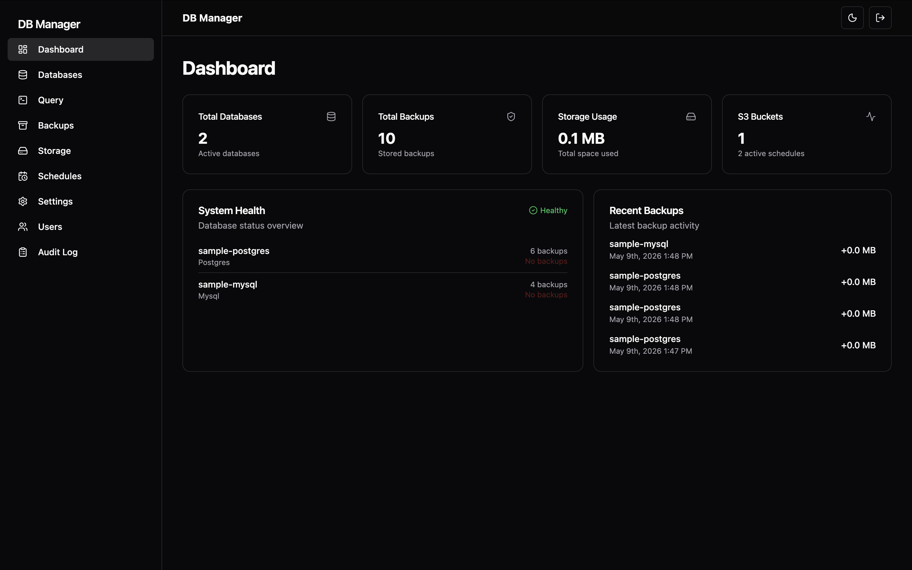

## Highlights

- 5 supported engines: **PostgreSQL, MySQL, MariaDB, SQL Server, MongoDB**
- Web UI for everything: connections, backups, schedules, storage, query editor, users, audit
- REST API with OpenAPI / Swagger UI
- Built-in **Caddy reverse proxy** with automatic HTTPS (Let's Encrypt DNS-01 / HTTP-01, manual cert, self-signed)
- Encrypted backups (AES-256 / ChaCha20), zstandard / gzip compression, SHA-256 checksums
- Offsite storage: AWS S3, Cloudflare R2, MinIO, SMB shares
- Cron-based schedules, retention policies (local + S3), notifications (Email / Slack / Teams / Discord)
- Multi-user with RBAC and full audit log of every action

## Quick start

```bash
git clone https://github.com/momysnow/dbmanager.git
cd dbmanager
docker compose up -d --build
# open http://localhost  →  admin / admin (change on first login)
```

Zero-config defaults: admin user is created on first run, JWT secret and master encryption key are auto-generated and persisted in `~/.dbmanager/`. See [INSTALLATION.md](INSTALLATION.md) for production setups (HTTPS, env vars, IaC).

## Screenshots

### Databases
Connect Postgres, MySQL, MariaDB, SQL Server or MongoDB. Connection test, status indicator, on-demand backup, query editor.

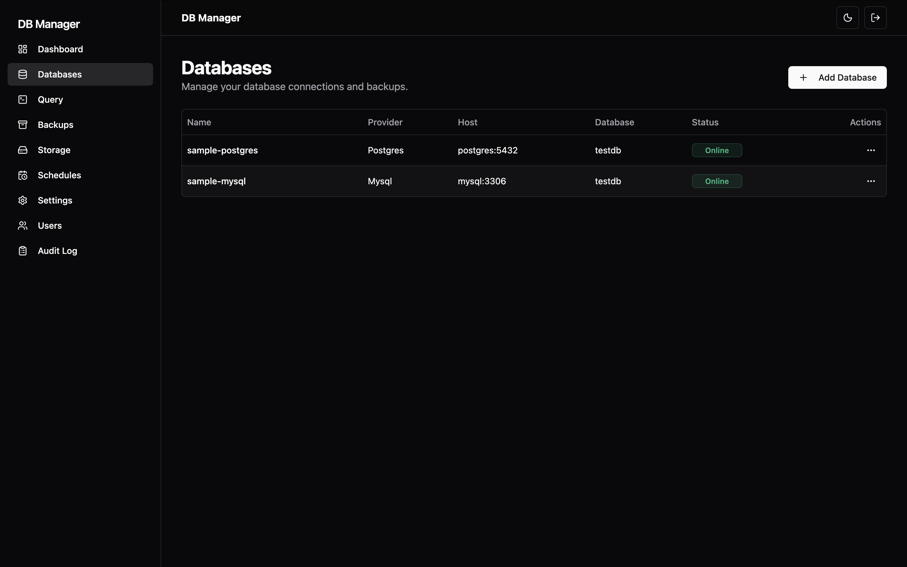

### Query editor — SQL & schema graph
SQL Editor with results, Data Editor, and an interactive Schema Graph showing tables and foreign-key relations.

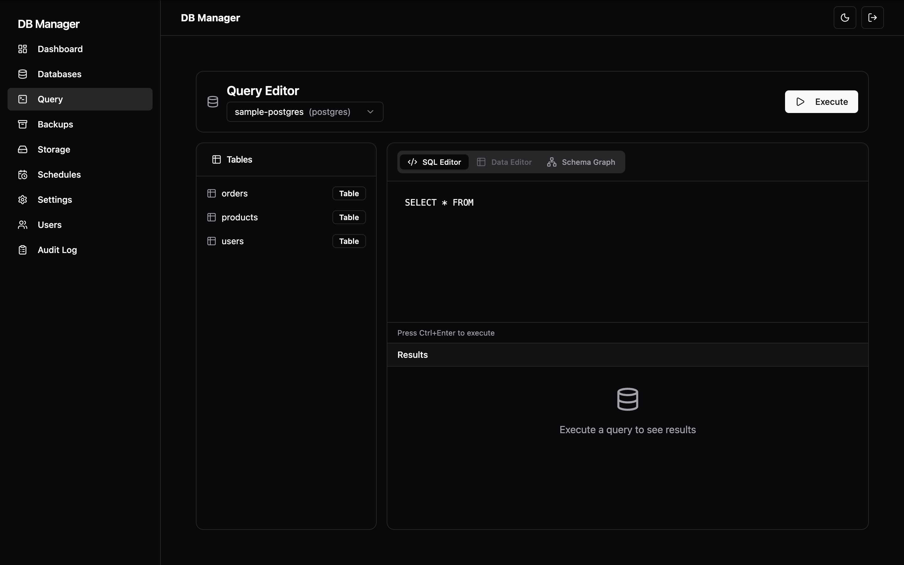
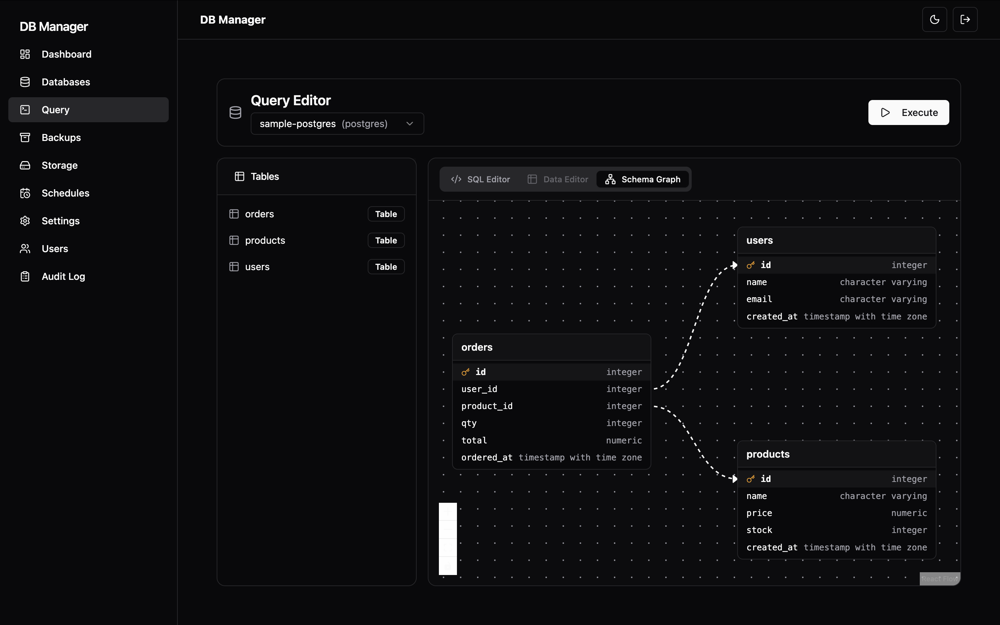

### Backups
Chronological list across all databases. Local + S3 / SMB locations, SHA-256 verification, one-click restore.

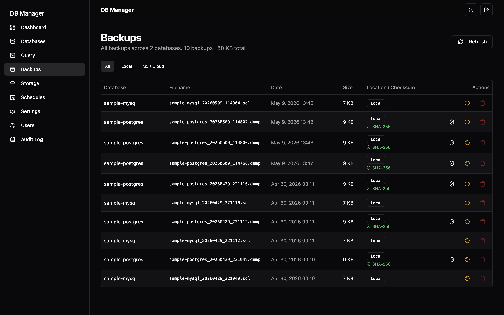

### Schedules
Cron-based automatic backups. Per-database, pausable, with status and next-run.

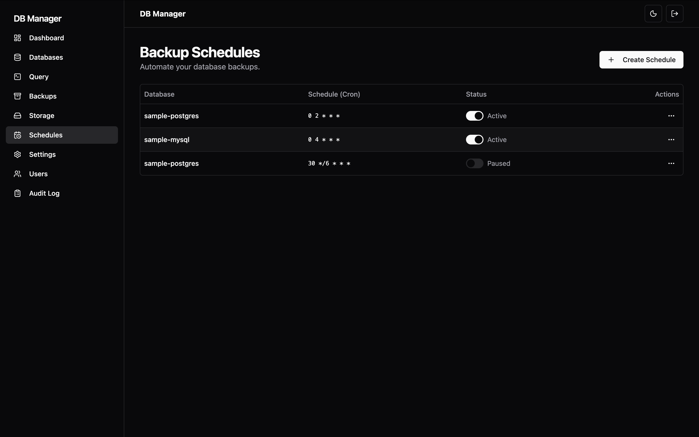

### Storage
S3-compatible (AWS, R2, MinIO) and SMB providers. Multiple destinations per deployment.

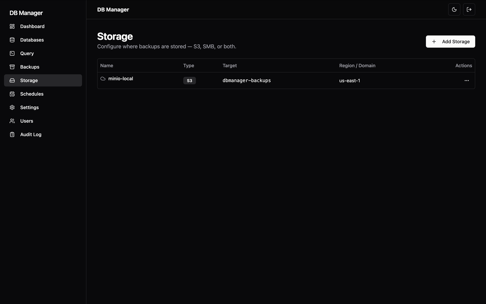

### Settings
Proxy / TLS, compression, encryption, notifications, backup config (export/import full config as a single zip).

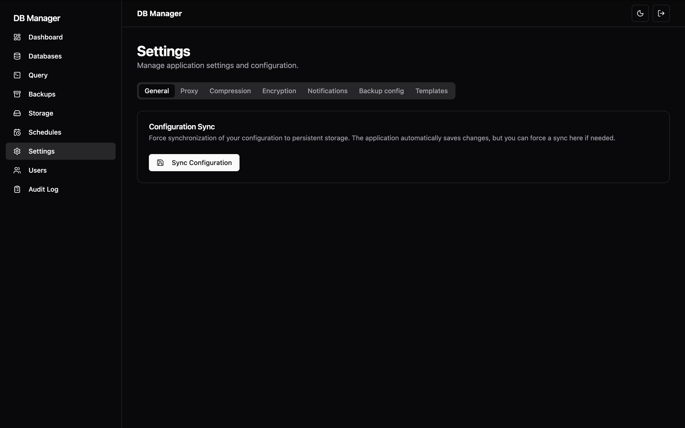

### Users & audit
Local user store with RBAC, password reset and a full audit log of every API call.

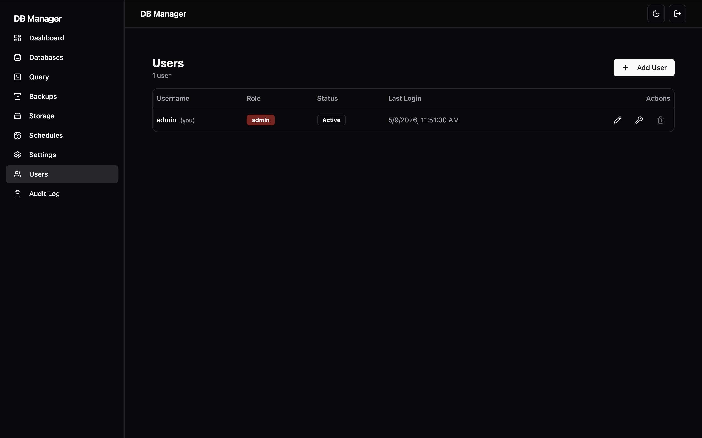
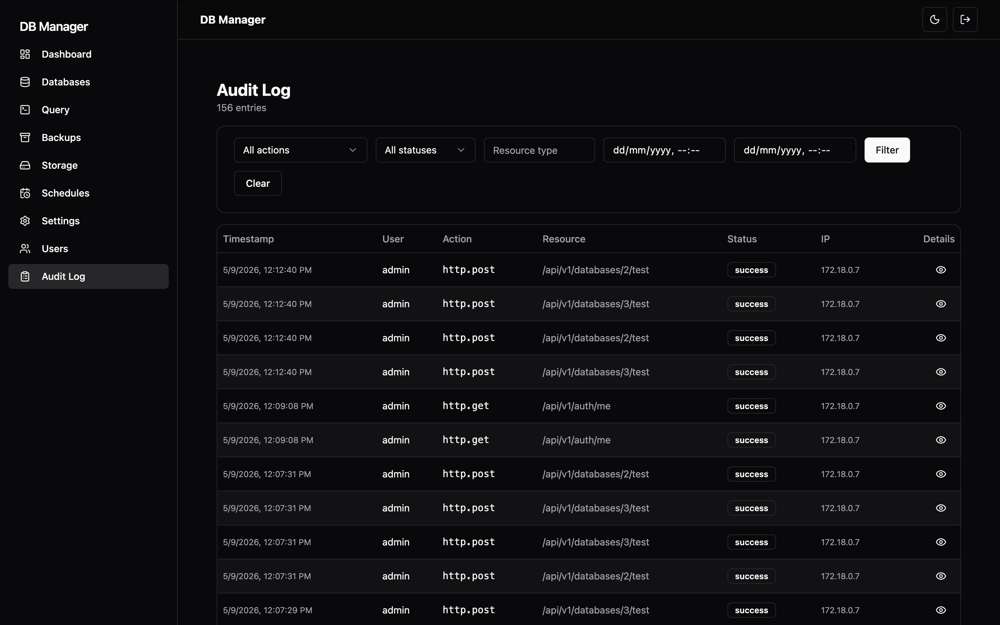

## Architecture

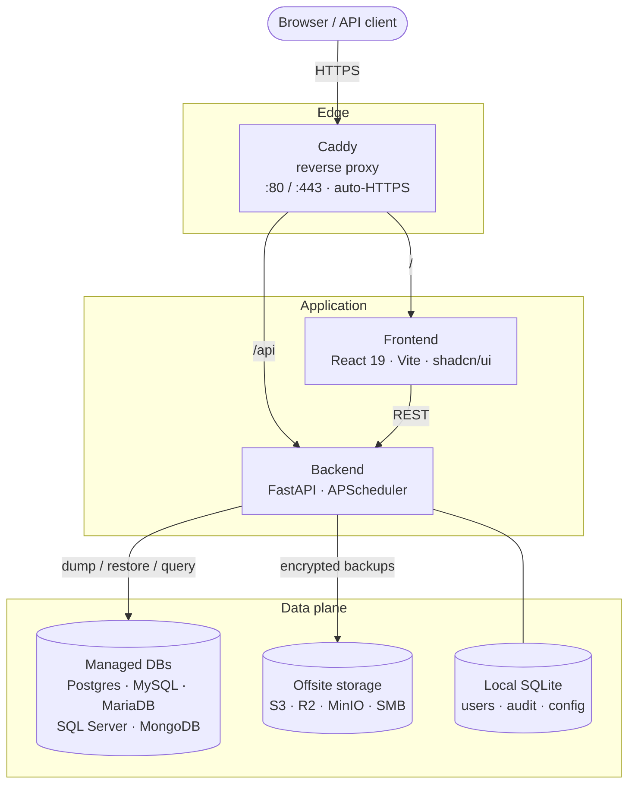

## Tech stack

- **Backend** — Python 3.10+, FastAPI, Uvicorn, APScheduler, SQLAlchemy + Alembic, boto3, pysmb, cryptography, zstandard
- **Frontend** — React 19, TypeScript, Vite, Tailwind CSS, shadcn/ui, React Flow (schema graph), Recharts
- **Infra** — Docker Compose, Caddy 2 (reverse proxy + ACME)
- **DB clients shipped in image** — PostgreSQL 18, MySQL/MariaDB, mssql-tools18, MongoDB Database Tools

## REST API

OpenAPI docs are served at `http://<host>/docs` once the stack is up.

```bash
# Login
curl -X POST http://localhost/api/v1/auth/token \
  -d 'username=admin&password=admin'

# Trigger a backup
curl -X POST http://localhost/api/v1/databases/1/backup \
  -H "Authorization: Bearer $TOKEN"
```

## Configuration

All settings are editable from the **Settings** page in the UI and persisted in `~/.dbmanager/config.json`. Same values can be pinned via environment variables — useful for IaC / immutable deployments. See `.env.example`.

| Variable                   | Description                            | Default     |
| -------------------------- | -------------------------------------- | ----------- |
| `DBMANAGER_CREATE_ADMIN`   | Create admin user on first run         | `true`      |
| `DBMANAGER_ADMIN_USER`     | Initial admin username                 | `admin`     |
| `DBMANAGER_ADMIN_PASSWORD` | Initial admin password                 | `admin`     |
| `DBMANAGER_JWT_SECRET`     | JWT secret for API tokens              | (generated) |
| `DBMANAGER_MASTER_KEY`     | Master key for config encryption       | (generated) |
| `DBMANAGER_PROXY_MODE`     | `http` / `https-letsencrypt` / `manual`| (UI)        |
| `DBMANAGER_PROXY_DOMAIN`   | Public domain for the reverse proxy    | (UI)        |
| `ALLOWED_ORIGINS`          | CORS origins (comma-separated)         | localhost   |

## Development

```bash
# Backend
cd backend
pip install -r requirements.txt -r requirements-dev.txt
uvicorn api_server:app --reload

# Frontend
cd frontend
npm install
npm run dev
```

Code quality (Black, Flake8, Mypy, ESLint) and pre-commit hooks are configured. Run `pre-commit run --all-files` before pushing.

## License

Apache License 2.0 — see [LICENSE](LICENSE).

## Contributing

Issues and PRs welcome. Please open an issue first for non-trivial changes so we can discuss scope.
